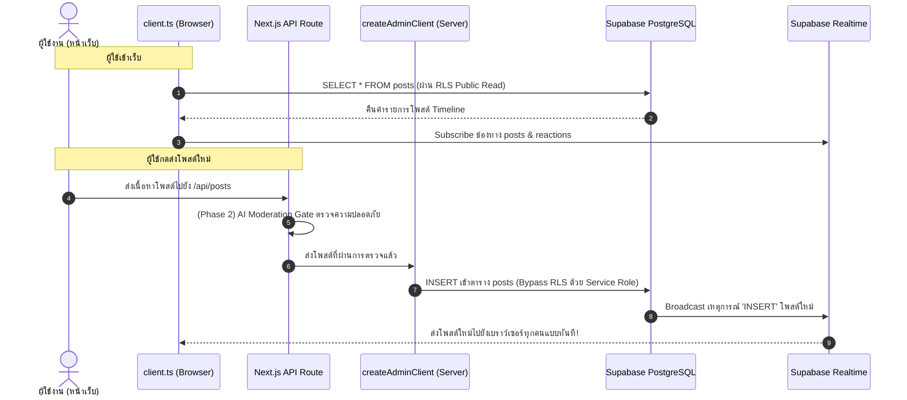

# 📘 Phase 1: Project Setup & Database Schema — สรุปภาพรวมและการทำงาน

เอกสารนี้สรุปรายละเอียดสิ่งที่ได้ดำเนินการใน **Phase 1** ของโปรเจกต์ **Anonymous Safe Space** เพื่อเป็นคู่มือศึกษาและอ้างอิงขั้นตอนการทำงานของสถาปัตยกรรมระบบ

---

## 1. สิ่งที่สร้างและตั้งค่าใน Phase 1

```
Project-Ano/
├── backend/
│   └── supabase/
│       └── schema.sql              # โครงสร้างฐานข้อมูล, RLS และ Trigger
├── frontend/
│   ├── .env.example                # แม่แบบตัวแปรสภาพแวดล้อม
│   ├── .env.local                  # ไฟล์เก็บ API Keys จริง (ถูกกันไว้ใน .gitignore)
│   └── src/
│       ├── types/
│       │   └── database.types.ts   # TypeScript Interface ตรงตามฐานข้อมูล
│       └── lib/
│           └── supabase/
│               ├── client.ts       # Supabase Client สำหรับฝั่งหน้าเว็บ (Browser)
│               └── server.ts       # Supabase Client สำหรับฝั่งเซิร์ฟเวอร์ (Server/Admin)
```

---

## 2. เจาะลึกแต่ละส่วนและการทำงาน

### 2.1 โครงสร้างฐานข้อมูล (`backend/supabase/schema.sql`)

ฐานข้อมูลถูกออกแบบภายใต้หลักการความปลอดภัยสูงสุด 3 ประการ:
1. **Zero PII (ไม่มีข้อมูลระบุตัวตน):** ไม่มีการเก็บ Email, เบอร์โทรศัพท์, หรือ IP Address
2. **AI Gate Enforcement:** ป้องกันไม่ให้หน้าเว็บ Insert โพสต์ตรงๆ ทุกโพสต์ต้องผ่าน AI ก่อน
3. **Positive Empathy Only:** รองรับเฉพาะการส่งกำลังใจเชิงบวก ไม่มีปุ่ม Dislike

#### ตารางในระบบ:
- **`posts`**: เก็บโพสต์ระบายความในใจ, Mood Tag, ฉายาสุ่ม (Alias), รูป Avatar สุ่ม และคะแนน Support
- **`reactions`**: เก็บการส่งกำลังใจ จำกัดเฉพาะ 3 ประเภท:
  - `'hug'` (กอดนะ)
  - `'listen'` (รับฟังอยู่)
  - `'cheer'` (เป็นกำลังใจให้)
  - มีเงื่อนไข `UNIQUE(post_id, user_session_id, reaction_type)` เพื่อให้ 1 คนกด Reaction แต่ละประเภทได้ครั้งเดียวต่อ 1 โพสต์
- **`safety_audit_logs`**: บันทึก Log ฝั่งเซิร์ฟเวอร์เมื่อมีข้อความ Toxic หรือเข้าข่ายวิกฤตถูก AI ตรวจจับและสกัดกั้น

#### ฟังก์ชันและ Trigger อัตโนมัติ:
- ฟังก์ชัน `handle_reaction_count()`: เมื่อมีคนกด Reaction หรือยกเลิก Reaction ระบบจะบวก/ลบตัวเลข `support_count` ในตาราง `posts` ให้เองอัตโนมัติ

#### ระบบความปลอดภัย (Row Level Security - RLS):
- **`posts`**: อนุญาตให้สาธารณะ `SELECT` (อ่าน) ได้อย่างเดียว แต่ **ห้าม `INSERT` ตรงจากหน้าเว็บ**
- **`reactions`**: อนุญาตให้สาธารณะ `SELECT`, `INSERT` และ `DELETE` (กดและยกเลิกกำลังใจของตัวเองได้)
- **`safety_audit_logs`**: ไม่อนุญาตให้บุคคลทั่วไปเข้าถึง (เข้าถึงได้เฉพาะ Service Role ฝั่ง Server เท่านั้น)

#### Supabase Realtime Publication:
- นำตาราง `posts` และ `reactions` เข้าสู่ `supabase_realtime` เพื่อส่งสัญญาณอัปเดตข้อมูลแบบสดๆ ไปยังผู้ใช้งานทุกคนพร้อมกัน

---

### 2.2 TypeScript Type Definitions (`frontend/src/types/database.types.ts`)

ทำหน้าที่เป็น **Single Source of Truth** ด้าน Type ของโปรเจกต์:
- ป้องกันข้อผิดพลาด (Type Safety) ขณะเขียนโค้ด
- กำหนด Type สำหรับ Mood Tags และ Reactions:
  ```typescript
  export type ReactionType = 'hug' | 'listen' | 'cheer'
  export type MoodTag = 
    | 'ระบายความในใจ'
    | 'เหนื่อยล้า'
    | 'ต้องการกำลังใจ'
    | 'เรื่องความสัมพันธ์'
    | 'เรื่องเรียน/งาน'
    | 'เหงาจัง'
  ```

---

### 2.3 Supabase Client Architecture (`frontend/src/lib/supabase/`)

เราแยกการเชื่อมต่อออกเป็น 2 ฝั่งเพื่อความปลอดภัยสูงสุด:

#### ฝั่ง Browser: `client.ts`
- ใช้ `createBrowserClient` ร่วมกับ `NEXT_PUBLIC_SUPABASE_ANON_KEY`
- ใช้สำหรับอ่านโพสต์, ส่ง Reaction, และเปิดช่องทางฟัง Realtime Subscription เมื่อมีโพสต์ใหม่

#### ฝั่ง Server: `server.ts`
- **`createClient()`**: สำหรับ Server Component ทั่วไป จัดการ Cookie/Session ของ Next.js อัตโนมัติ
- **`createAdminClient()`**: ใช้ `SUPABASE_SERVICE_ROLE_KEY` (สิทธิ์ Admin สูงสุด) ซึ่งทำงานบนเซิร์ฟเวอร์เท่านั้น เพื่อนำโพสต์ที่ผ่านการตรวจสอบจาก AI บันทึกลงตาราง `posts`

---

## 3. แผนภาพแสดง Data Flow การทำงาน (Phase 1 Integration)



---

## 4. สถานะปัจจุบันและขั้นตอนถัดไป

- [x] **Phase 1: Project Setup & DB Schema** (เสร็จสมบูรณ์)
- [ ] **Phase 2: AI Moderation Engine & Posts API** (ขั้นตอนถัดไป)
- [ ] **Phase 3: Core UI & Realtime Timeline**
- [ ] **Phase 4: Empathy Reactions & Crisis Pop-ups**
- [ ] **Phase 5: Edge Case & Red Teaming Test**
