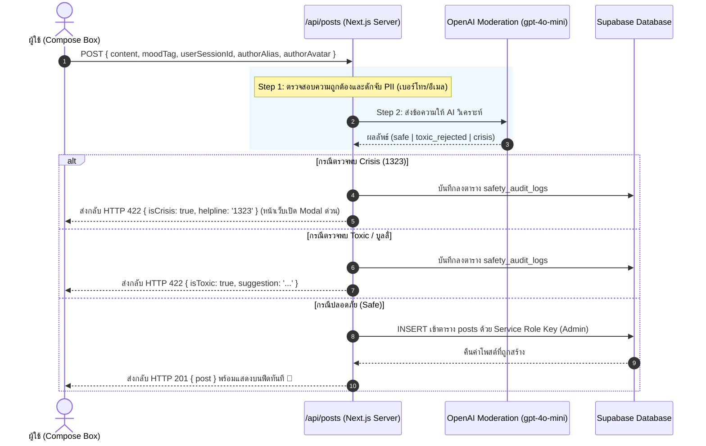

# 🛡️ Phase 2: AI Moderation Engine & Posts API — สรุปภาพรวมและการทำงาน

เอกสารนี้สรุปรายละเอียดสิ่งที่ได้ดำเนินการใน **Phase 2: AI Moderation Engine** เพื่อเป็นคู่มือศึกษาและอ้างอิง

---

## 1. ไฟล์ที่พัฒนาขึ้นใน Phase 2

```
frontend/src/
├── utils/
│   └── anonymous-identity.ts     # 1. ระบบสุ่มตัวตนนิรนามและ Anonymous Session ID (Zero PII)
├── lib/
│   └── openai/
│       └── moderation.ts         # 2. สมองกล AI Moderation (ตรวจ Toxic / Crisis 1323)
└── app/
    └── api/
        └── posts/
            └── route.ts          # 3. Server API Route Gate (GET / POST /api/posts)
```

---

## 2. เจาะลึกการทำงานแต่ละส่วน

### 2.1 ระบบสร้างตัวตนนิรนาม (`src/utils/anonymous-identity.ts`)
- **Dynamic Anonymous Identity:** สุ่มฉายาน่ารักและอบอุ่น เช่น *แมวส้มใจดี, ก้อนเมฆนักรับฟัง, เพนกวินผู้เข้มแข็ง* พร้อมไอคอนอีโมจิและโทนสีพาสเทล
- **Zero PII Session:** สร้าง Session ID แบบสุ่มประจำเครื่อง (`ano_xxxxxxxx`) โดยไม่มีการเก็บชื่อ เบอร์โทร หรืออีเมลของผู้ใช้

---

### 2.2 สมองกล AI Moderation (`src/lib/openai/moderation.ts`)
ใช้โมเดล **OpenAI `gpt-4o-mini`** (ตั้งค่า `temperature: 0.0` เพื่อความแม่นยำสูงสุด) แยกแยะข้อความเป็น 3 สถานะ:

1. **🚨 CRISIS (ภาวะวิกฤต/เสี่ยงทำร้ายตนเอง):**
   - ตรวจจับข้อความเช่น *"ไม่อยากอยู่แล้ว", "เหนื่อยจนอยากตาย", "ลาก่อน"*
   - คืนค่า `{ status: 'crisis', helpline: '1323' }` เพื่อให้หน้าเว็บเปิด Pop-up สายด่วนสุขภาพจิตทันที
2. **⚠️ TOXIC_REJECTED (คำหยาบ/บูลลี่/Hate Speech):**
   - คืนค่า `{ status: 'toxic_rejected', suggestion: '...' }` พร้อมคำแนะนำให้ปรับภาษาอย่างอ่อนโยน
3. **✅ SAFE (ข้อความปลอดภัยสำหรับการระบาย):**
   - คืนค่า `{ status: 'safe' }` อนุญาตให้บันทึกลงสู่ไทม์ไลน์

---

### 2.3 ประตูด่านความปลอดภัย API Route (`src/app/api/posts/route.ts`)

#### 🚪 POST `/api/posts` (การส่งโพสต์ใหม่):
1. **Input Sanitization:** ตรวจความยาวข้อความ (ไม่ว่างเปล่า และไม่เกิน 1,000 ตัวอักษร)
2. **Zero PII Filter:** ใช้ Regular Expression ดักจับและบล็อกเบอร์โทรศัพท์หรืออีเมลทันที
3. **AI Moderation Gate:** ส่งข้อความเข้าตรวจกับ `moderateContent()`
   - หากเป็น **Crisis / Toxic** $\rightarrow$ บันทึก Log ลงตาราง `safety_audit_logs` ใน Supabase และส่งรหัส Error 422 กลับไป
4. **Service Role Insertion:** หากปลอดภัย $\rightarrow$ ใช้ `createAdminClient()` บันทึกลงตาราง `posts` ทันที

#### 📖 GET `/api/posts` (การดึงโพสต์):
- ดึงโพสต์ล่าสุด 30 รายการ เรียงจากใหม่ไปเก่า พร้อมรองรับการกรองตาม **Mood Tag**

---

## 3. แผนภาพลำดับการทำงาน (AI Gate Flow)


